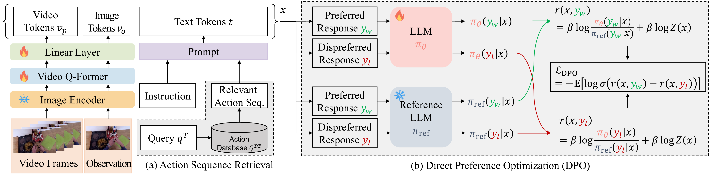

# EgoPlan_Challenge_Team_AAILab


## DPO-Finetuned Large Multi-Modal Planner with Retrieval Augmented Generation  <br><sub> </sub>
**Kwanghyeon Lee, Mina Kang, Hyungho Na, Heesun Bae, Byeonghu Na, Doyun Kwon, Seungjae Shin, Yeongmin Kim, Taewoo Kim, Seungmin Yun, and Il-Chul Moon**   
<sup> * Equal contribution </sup> <br>

| [paper] |  <br>
We will upload our paper to Arxiv soon.

## Overview


Our framework consists of two distinctive components: action sequence retrieval and direct preference optimization (DPO).

## Required Dataset and Model Checkpoint
- Our implementation is based on [EgoPlan](https://github.com/ChenYi99/EgoPlan).
- We used **Video & Image Instruction Dataset**, **Video & Image Dataset**, and **Model Checkpoint** refer to [EgoPlan](https://github.com/ChenYi99/EgoPlan).
- We also provide our generated **Action Database** and **Model Checkpoint**.
  - **Video & Image Instruction Dataset** for instruction tuning:
    - EgoPlan Benchmark Dataset (Train / Valid / Test):
      - Train (50K): [EgoPlan_IT.json](https://drive.google.com/file/d/139UXIgOXbK55tNlK03TBrdSWXdupfrL5/view)
      - Valid (3K): [EgoPlan_validation.json](https://drive.google.com/file/d/1Hy-mWrtuDjuq29iCQxCQzk0htTJs8SHg/view)
      - Test (2K): [EgoPlan_test.json](https://drive.google.com/file/d/1G3cH58qlXI11iRFc8R1oFXpHhEiOh4Bd/view)
    - Image-based Instructions from MiniGPT-4 (3K): [cc_sbu_align.zip](https://drive.google.com/file/d/1nJXhoEcy3KTExr17I7BXqY5Y9Lx_-n-9/view)
    - Image-based Instructions from LLaVA (150K): [llava_instruct_150k.json](https://huggingface.co/datasets/liuhaotian/LLaVA-Instruct-150K)
    - Video-based Instructions from VideoChat (11K): [videochat_instruct_11k.json](https://drive.google.com/file/d/1C-7xmf42QUEi4ApXTcxBHr5nLvTWXyUi/view)
  - **Video & Image Dataset**:
    - EpicKitchens dataset (for EgoPlan Benchmark): [EPIC-KITCHENS-100](https://github.com/epic-kitchens/epic-kitchens-download-scripts)
    - Ego4D dataset (for EgoPlan Benchmark): [Ego4D](https://ego4d-data.org/#download)
    - cc_sbu_align dataset (for MiniGPT-4 Instruction): [cc_sbu_align_multilang](https://huggingface.co/datasets/dinhanhx/cc_sbu_align_multilang) (We download dataset not from [cc_sbu_align](https://huggingface.co/datasets/Vision-CAIR/cc_sbu_align) because it has only 149 images.)
    - MS COCO datset (for LLaVA Instruction): [MS COCO 2014 Training Images](http://deltalab.iitk.ac.in/index.php?n=Main.MSCOCO2014Dataset)
    - WebVid Dataset (for VideoChat Instuction): Since [WebVid dataset](https://github.com/m-bain/webvid) is no longer available, we download webvid dataset from real link by bash.
  - **Model Checkpoint**:
    - Vanilla Video-LLaMA: [Vanilla Video-LLaMA](https://huggingface.co/DAMO-NLP-SG/Video-LLaMA-2-7B-Finetuned)
    - Finetuned Video-LLaMA with EgoPlan_IT dataset: [Finetuned Video-LLaMA](https://huggingface.co/ChenYi99/EgoPlan-Video-LLaMA-2-7B) (with lora weights)
    - Vision Transformer: [eva_vit_g.pth](https://huggingface.co/lainxx/eva_vit_g/blob/main/eva_vit_g.pth)
    - Q-Former: [blip2_pretrained_flant5xxl.pth](https://huggingface.co/spaces/Vision-CAIR/minigpt4/blob/main/blip2_pretrained_flant5xxl.pth)
    - BERT: [bert-base-uncased](https://huggingface.co/google-bert/bert-base-uncased)
  - **Our RAG Dataset**
    - You can download RAG training dataset from [here](https://drive.google.com/drive/folders/1JmXCK3QZJSxjP8a-DcBPWSAQQoqvK98S?usp=sharing) and validation dataset from [here](https://drive.google.com/drive/folders/1JmXCK3QZJSxjP8a-DcBPWSAQQoqvK98S?usp=sharing).
  - **Our Checkpoint**
    - You can download our model ckpt from [here](https://drive.google.com/drive/folders/1zBRv-OIm9SaAis9wmAAf2BBQxCFhp3gj?usp=sharing).

## Dataset Setting
- Here, our own RAG dataset.
- Place **data** at the directory specified below.
  ```
  ${project_page}/DG/
  ├── checkpoints
  │   ├── pretrained_score/edm-cifar10-32x32-uncond-vp.pkl
  │   ├── pretrained_score/edm-cifar10-32x32-cond-vp.pkl
  ├── ...
  ```

- Place **model weights** at the directory specified below.

  ```
  ${project_page}/DG/
  ├── checkpoints
  │   ├── pretrained_score/edm-cifar10-32x32-uncond-vp.pkl
  │   ├── pretrained_score/edm-cifar10-32x32-cond-vp.pkl
  ├── ...
  ```

## Running of DPO-Finetuned Large Multi-Modal Planner with Rag

### 1) Finetuning 
    
  - run
  ```bash
  bash scripts/format_parser.sh fine dpo_to_dpo_add_narr_rag_v4_base_rag 0,1,2,3,4,5,6,7 8 26501
  ```

### 2) Evaluation

  - run
  ```bash
  bash scripts/test.sh fine dpo_to_dpo_add_narr_rag_v4_base_rag 0 format_eval --epoch,{epoch num},--time,{folder_name}

  ```
  
   

### 3) Test
 
  - run
  ```bash
  bash scripts/test.sh fine dpo_to_dpo_add_narr_rag_v4_base_rag 0 format_test --epoch,{epoch num},--time,{folder_name}
  ```


## Experimental Results
### 1) Test accuracies with regard to our method components
|                  | DPO loss | RAG  | Ensemble | Test Acc.(%) |
|------------------|:--------:|:----:|:--------:|:------------:|
| Base →           |         |      |          | 41.35        |
|                  | ✔        |     |          | 53.98        |
|                  | ✔        | ✔    |         | 58.21        |
| Ours →           | ✔        | ✔    | ✔        | **60.98**    |

### 2) Validation accuracies for various combinations of our method components
|                 | Base      | Loss type               | RAG  | Valid Acc.(%) / Approx. Training Time  |
|-----------------|-----------|-------------------------|:----:|---------------------------------------:|
| **Baseline**    | Original  | -             | -    | 30.44† / Given Pre-trained Model       |
|                 |           |Contrastive                 | ✗    | 44.42† / Given Pre-trained Model       |
| **Ours**        | Original  | Contrastive             | ✓    | 52.44 / 0.5 days                       |
|                 |           | DPO                     | ✗    | 60.24 / 0.5 days                       |
|                 |           | DPO                     | ✓    | 52.44 / 0.5 days                       |
|                 | DPO-Finetuned | Contrastive (Iterative) | ✓ | 53.09 / 0.5 days                       |
|                 |           | DPO (Iterative)         | ✗    | 61.11 / 0.5 days                       |
|                 |           | DPO (Iterative)         | ✓    | **67.17 / 0.5 days**                   |

Note that Base indicates the initial checkpoint from which the model is fine_tuned.


## Reference
If you find the code useful for your research, please consider citing
```bib
@article{
}
```
This work is heavily built upon the code from
 - EgoPlan-Bench [EgoPlan](https://github.com/ChenYi99/EgoPlan)
 - **
 - **


 ## Acknowledgement
This repo benefits from [Epic-Kitchens](https://epic-kitchens.github.io/2023), [Ego4D](https://ego4d-data.org/), 
[EgoPlan](https://github.com/ChenYi99/EgoPlan), 
[Video-LLaMA](https://github.com/DAMO-NLP-SG/Video-LLaMA), 
[LLaMA](https://github.com/facebookresearch/llama),
[MiniGPT-4](https://github.com/Vision-CAIR/MiniGPT-4), 
[LLaVA](https://github.com/haotian-liu/LLaVA), 
[VideoChat](https://github.com/OpenGVLab/Ask-Anything). Thanks for their wonderful works!
